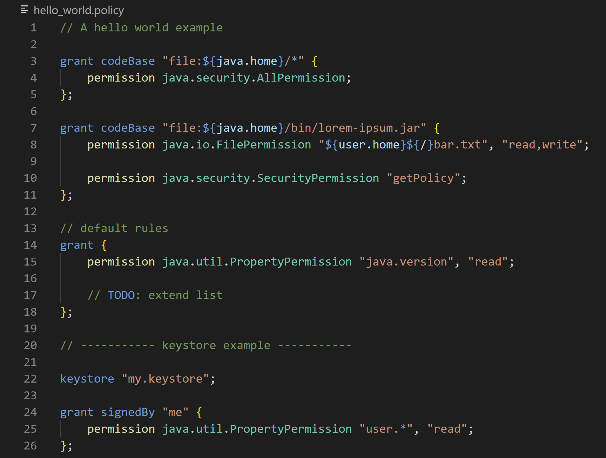

# README

Syntax highlighting for [Java policy files](https://docs.oracle.com/javase/7/docs/technotes/guides/security/PolicyFiles.html) used by the [deprecated Security Manager](https://openjdk.org/jeps/411).

## Screenshot

## Call for action

Do not hesitate to [create an issue](https://github.com/anticultist/vscode-java-policy/issues/new) for unrecognized code.
But make sure to provide a minimal code example and a brief description.
