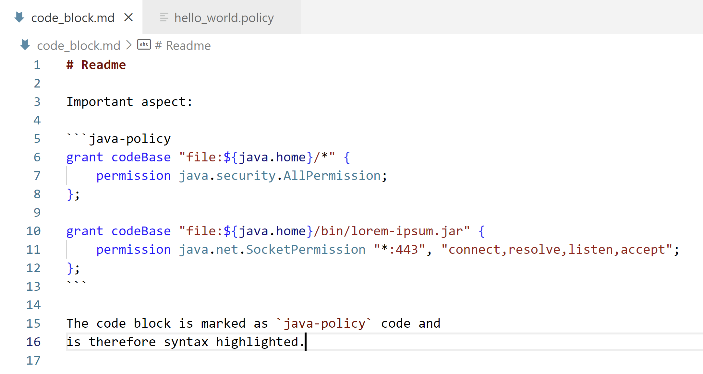

# Policy Files

Syntax highlighting for [Java policy files](https://docs.oracle.com/javase/7/docs/technotes/guides/security/PolicyFiles.html) used by the deprecated Security Manager ([JEP 411](https://openjdk.org/jeps/411)).

## Screenshot

## Feedback

Share your feedback as a [GitHub issue](https://github.com/anticultist/vscode-java-policy/issues/new).
